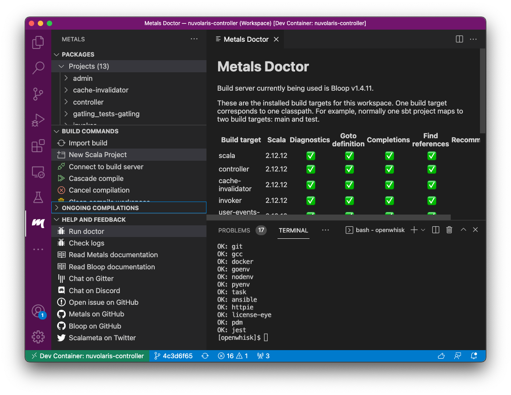

<!--
  ~ Licensed to the Apache Software Foundation (ASF) under one
  ~ or more contributor license agreements.  See the NOTICE file
  ~ distributed with this work for additional information
  ~ regarding copyright ownership.  The ASF licenses this file
  ~ to you under the Apache License, Version 2.0 (the
  ~ "License"); you may not use this file except in compliance
  ~ with the License.  You may obtain a copy of the License at
  ~
  ~   http://www.apache.org/licenses/LICENSE-2.0
  ~
  ~ Unless required by applicable law or agreed to in writing,
  ~ software distributed under the License is distributed on an
  ~ "AS IS" BASIS, WITHOUT WARRANTIES OR CONDITIONS OF ANY
  ~ KIND, either express or implied.  See the License for the
  ~ specific language governing permissions and limitations
  ~ under the License.
  ~
-->
# nuvolaris-controller

This repo builds the OpenWhisk controller that is the core of OpenWhisk and publishes the images in the GitHub docker registry.

It includes as a subrepo our fork of [apache/openwhisk](https://github.com/nuvolaris/openwhisk)

You can discuss it in the #[nuvolaris-controller](https://discord.gg/2weUATjvV7) discord channel and in the forum under the category [controller](https://github.com/nuvolaris/nuvolaris/discussions/categories/controller).

## Developer Guide

To develop with this repo, please use [VSCode](https://code.visualstudio.com/). You can use other IDEs if you want but for VSCode there is the configuration ready. Note that you need also Docker running.

You can put it at work with the following procedure

1. clone everyting and open it in VSCode:
```
git clone https://github.com/nuvolaris/nuvolaris --recurse-submodules
code nuvolaris
```

2. It will open and show a pop-up asking if you want to `Reopen in Container`. Click on it. 

3. When it has finished, open the `workspace.code-workspace` file and then open the workspace (there will be a button to do that, click on it).

4. Open the Metals plugin (click on the icon that looks like an 'm').
To import the project, click on `New Scala Project` (but do not create any project actually) then `import build`. This will activate the Metals plugin, it will import all the subprojects and make available all the features of the plugin.

5. Check `Run doctor` to verify the projects has been imported correctly. An healthy import looks like this:


